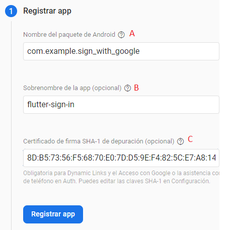
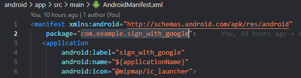
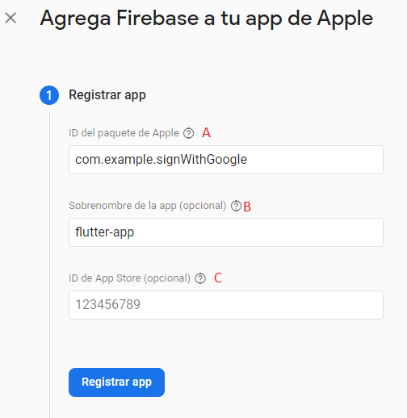
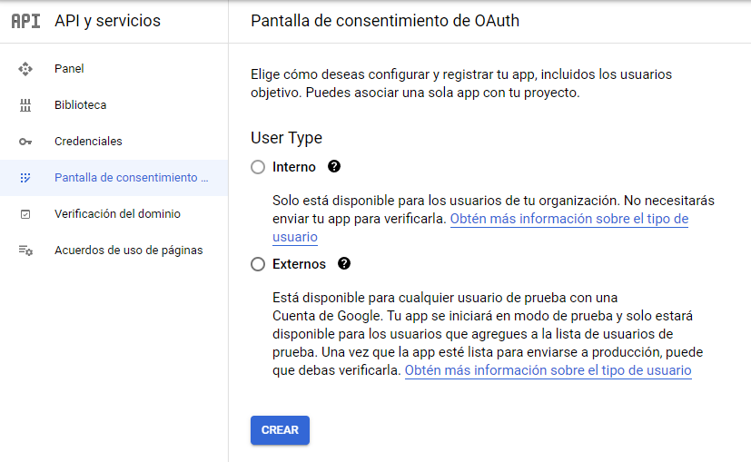

## Google Sign In.
Flutter configuration to deal Google sign in authentication. 

## Firebase configuration

1. Open [Firebase console](https://console.firebase.google.com/) and create a new project.
2. Choose one of them(android, ios or web).<br>

3. Depending on the platform, follow the instructions below.

### Setup for Android
More info in `<google_sign_in>` : <https://pub.dev/packages/google_sign_in>.
1. Configuration screen is shows and register your application as the next picture.<br>

2. Copy project id from **android>app>src>main>AndroidManifest.xml** in **A**. <br>

3. Put application name in **B**
4. Go to project's android directory, then run the following command in the terminal and copy the first generated sha1 key in **C**.<br>
```sh
> cd .\android\
> ./gradlew signingReport
```
5. Press in **Registrar app**
6. Download **google-services.json** file, then move or copy it into **android>app>** directory. Finally press **next** til end.

### Setup for IOS
More info in `<google_sign_in>` : <https://pub.dev/packages/google_sign_in>
1. Configuration screen is shows and register your application as the next picture.<br>

2. Copy project id from **ios\Runner.xcodeproj\project.pbxproj** (PRODUCT_BUNDLE_IDENTIFIER) in **A**. <br>
3. Put application name in **B**
4. Make sure the file you download in step 1 is named GoogleService-Info.plist.
5. Move or copy GoogleService-Info.plist into the [my_project]/ios/Runner directory.
6. Open Xcode, then right-click on Runner directory and select Add Files to "Runner".
7. Select GoogleService-Info.plist from the file manager.
8. A dialog will show up and ask you to select the targets, select the Runner target.
9. Then add the CFBundleURLTypes attributes below into the [my_project]/ios/Runner/Info.plist file. <br>

```javascript
<!-- Put me in the [my_project]/ios/Runner/Info.plist file -->
<!-- Google Sign-in Section -->
<key>CFBundleURLTypes</key>
<array>
	<dict>
		<key>CFBundleTypeRole</key>
		<string>Editor</string>
		<key>CFBundleURLSchemes</key>
		<array>
			<!-- TODO Replace this value: -->
			<!-- Copied from GoogleService-Info.plist key REVERSED_CLIENT_ID -->
			<string>com.googleusercontent.apps.861823949799-vc35cprkp249096uujjn0vvnmcvjppkn</string>
		</array>
	</dict>
</array>
<!-- End of the Google Sign-in Section -->
```

### Warning
If authentication doesn't work, go to  [Google Developers Console](https://console.cloud.google.com/apis/dashboard), select project and **OAuth consent screen**<br>



After that, choose an option according to your requirements and follow the instructions.


```python

```
